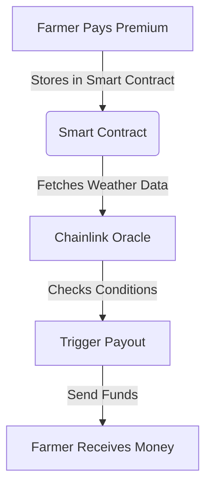

# 🌾 Smart Contract-Based Micro-Insurance for Farmers

## 🚀 Introduction

This project was developed as part of a **Hackathon** to provide a **blockchain-powered micro-insurance system** for small farmers in India. It uses **smart contracts** to automate **insurance payouts** based on real-time weather data fetched from **Chainlink Oracles**. This eliminates bureaucratic delays, ensuring **timely financial relief** during natural disasters like droughts and floods.

---

## ⚡ Problem Statement

**Why is this relevant for India?**
- Small farmers often face **delayed insurance payouts** due to **bureaucratic inefficiencies**.
- Traditional insurance processing is slow, leading to **financial distress** in case of natural disasters.
- A **blockchain-powered parametric insurance** system can solve this issue by automating **payouts based on weather conditions**.

**How does it work?**
1. **Farmers pay insurance premiums** through a smart contract.
2. **Chainlink Oracles fetch real-time weather data** (e.g., drought, floods).
3. If predefined conditions (e.g., extreme rainfall, drought) are met, **the smart contract automatically triggers payouts**.

---

## 🔧 Tech Stack

- **Blockchain**: Ethereum (Solidity for Smart Contracts)
- **Backend**: Java (Spring Boot for API handling)
- **Frontend**: React.js (User interface for farmers and insurers)
- **Smart Contract Execution**: Go (for additional blockchain interactions)
- **Oracles**: Chainlink (fetching real-time weather data)
- **Database**: PostgreSQL
- **Hosting**: Heroku / Firebase

---

## 🏗️ Project Architecture



---

## 📦 Installation & Setup

### Prerequisites
- **Node.js & npm** (For React frontend)
- **Java 11+** (For Spring Boot backend)
- **Go** (For blockchain execution layer)
- **MetaMask** (For blockchain transactions)
- **Hardhat** (For smart contract deployment)

### 1️⃣ Clone the repository
```sh
git clone https://github.com/your-username/micro-insurance.git
cd micro-insurance
```

### 2️⃣ Backend (Java + Spring Boot)
```sh
cd backend
./mvnw spring-boot:run
```

### 3️⃣ Smart Contracts (Solidity + Hardhat)
```sh
cd smart-contracts
npm install
npx hardhat test
npx hardhat deploy --network goerli
```

### 4️⃣ Frontend (React.js)
```sh
cd frontend
npm install
npm start
```

---

## 🎯 Features
✅ **Automated Insurance Payouts** via Smart Contracts  
✅ **Real-Time Weather Data Integration** using Chainlink Oracles  
✅ **Decentralized & Transparent** system for farmers  
✅ **React UI** for Farmers & Insurers to interact with the platform  
✅ **Backend API (Spring Boot)** for managing transactions & users  
✅ **Multi-Language Support** (Future Enhancement)  

---

## 📜 Smart Contract Overview

```solidity
pragma solidity ^0.8.0;

import "@chainlink/contracts/src/v0.8/interfaces/AggregatorV3Interface.sol";

contract MicroInsurance {
    address public insurer;
    mapping(address => uint256) public premiums;
    AggregatorV3Interface internal weatherOracle;

    constructor(address _oracle) {
        insurer = msg.sender;
        weatherOracle = AggregatorV3Interface(_oracle);
    }
    
    function payPremium() external payable {
        premiums[msg.sender] += msg.value;
    }

    function checkPayoutConditions() public view returns (bool) {
        (,int256 weatherData,,,) = weatherOracle.latestRoundData();
        return weatherData < 50; // Example threshold
    }
}
```

---

## 🛠️ Deployment (Heroku & Firebase)

### Deploy Backend to Heroku
```sh
cd backend
git init
git add .
git commit -m "Deploy backend"
heroku create micro-insurance-api
heroku config:set DATABASE_URL=your_database_url
heroku deploy
```

### Deploy Frontend to Firebase
```sh
cd frontend
npm run build
firebase deploy
```

---

## 🚧 Challenges Faced

### ⏳ Time Constraints
Developing a fully functional prototype within a limited hackathon timeframe was a challenge. Prioritizing key features was essential.

### 📡 Reliable Oracle Data
Ensuring that **Chainlink Oracles** provided accurate and timely weather data was critical. Testing various data sources helped improve reliability.

### 🔗 Smart Contract Gas Fees
High Ethereum gas fees were a concern. We optimized smart contracts to minimize costs and explored Layer 2 solutions.

### 🔒 Security & Transparency
Ensuring **secure payouts** while maintaining **transparency** was a challenge. Implementing **auditable smart contracts** helped mitigate risks.

### 📱 User Accessibility
Farmers with **limited tech literacy** needed a simple UI/UX. We designed an **intuitive interface** with minimal complexity.

---

## 📝 To-Do List
- [ ] Add **multi-language support** for Indian farmers.
- [ ] Implement **mobile app version** with React Native.
- [ ] Enhance **UX/UI for better accessibility**.
- [ ] Improve **Oracle data integration** for more accurate payouts.

---

## 👨‍💻 Contributing

🔹 **Fork the repository**  
🔹 **Create a feature branch** (`git checkout -b feature-xyz`)  
🔹 **Commit your changes** (`git commit -m 'Add new feature'`)  
🔹 **Push to the branch** (`git push origin feature-xyz`)  
🔹 **Create a Pull Request** 🚀  

---

## 📜 License
This project is licensed under the **MIT License**.

---

## 🙌 Acknowledgments
- **Ethereum & Solidity** for the Smart Contract Framework
- **Chainlink** for Oracle Services
- **Spring Boot** for backend services
- **React.js** for UI development
- **Go** for blockchain-related backend execution

---

## 📬 Contact
For inquiries, reach out via:
📩 Email: your-email@example.com  
🐦 Twitter: [@yourhandle](https://twitter.com/yourhandle)  
📂 GitHub: [your-username](https://github.com/your-username)
